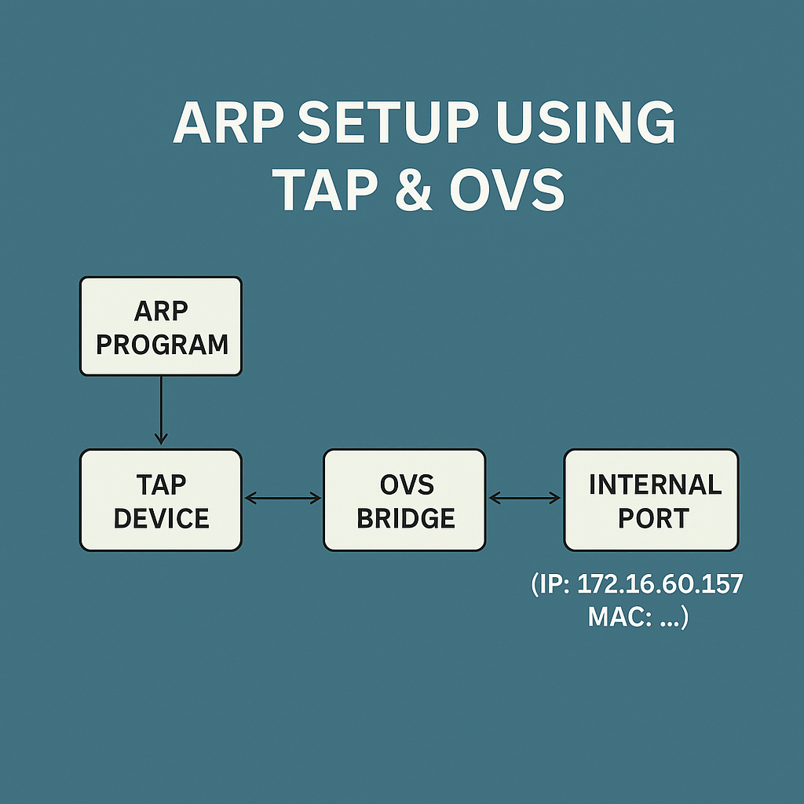

## Introduction

Low-level networking protocols have always fascinated me—especially ARP (Address Resolution Protocol), which operates quietly beneath the abstractions provided by modern operating systems. ARP is simple, elegant, and critical for everyday networking, bridging the gap between Layer 2 (MAC addresses) and Layer 3 (IP addresses).

To truly understand how ARP works, I wrote a C program that manually crafts and responds to ARP packets using a **TAP device**, a virtual Ethernet-level interface. To avoid interfering with my physical network, I used **Open vSwitch (OVS)** to create an isolated virtual environment, complete with an internal port and TAP interface.

Full source code:  
[github.com/Ali-Nasrolahi/arp-raw-tap](https://github.com/Ali-Nasrolahi/arp-raw-tap)

---

## Core Concepts and Tools

Before diving into the implementation, here’s a brief overview of the key components:

1. **ARP (Address Resolution Protocol)**  
   Resolves IP addresses to MAC addresses within a local network. It operates at Layer 2 (Ethernet) and relies on broadcast requests and unicast replies.

2. **Linux TUN/TAP Driver**  
   TAP devices let user-space programs send and receive **raw Ethernet frames**, making them ideal for Layer 2 protocol experimentation. Unlike TUN (which handles Layer 3 packets), TAP offers full Ethernet-level control.

3. **Open vSwitch (OVS)**  
   A programmable software switch for virtual networking. I used it to create a bridge connecting a TAP device and an internal port—simulating a real Ethernet segment.

4. **Packet Inspection Tools**  
   Tools like `tcpdump` and `tshark` (Wireshark) are invaluable for debugging and inspecting packet flows.

(See [References](#references) for further reading.)

---

## Virtual Lab Setup

To experiment safely, I built the following virtual topology:



### Key Steps

1. **Create the TAP device** (persistent, raw Ethernet):  

   ```bash
   sudo ip tuntap add dev tap0 mode tap
   sudo ip link set tap0 up
   ```

2. **Set up the OVS bridge and connect interfaces**:  

   ```bash
   sudo ovs-vsctl add-br br0
   sudo ovs-vsctl add-port br0 tap0
   sudo ovs-vsctl add-port br0 int0 -- set interface int0 type=internal
   sudo ip addr add 192.168.1.10/24 dev int0
   sudo ip link set int0 up
   ```

3. **Verify connectivity**:  

   ```bash
   ping -c 1 192.168.1.10 # Should work if everything is configured properly
   ```

This setup ensures that ARP packets sent on `tap0` are visible to `int0`, effectively emulating a broadcast domain.

---

## Program Design: ARP Requestor and Responder

The C program runs in two modes, demonstrating both sides of ARP communication:

### 1. **ARP Request Mode**  

- Crafts an Ethernet frame with an ARP request.  
- Source IP is configurable; destination MAC is broadcast.  
- Listens for ARP replies matching the target IP.  

### 2. **ARP Responder Mode**  

- Listens for ARP requests for any IP.  
- Replies with a TAP MAC address.  

To observe the ARP traffic:  

```bash
sudo tcpdump -i tap0 -n -e arp
```

---

## Lessons Learned and Pitfalls

### 1. **Endianness is Critical**  

Network protocols use **big-endian** byte order, while most modern CPUs (x86/ARM) use **little-endian**. Forgetting to use `htons()`/`htonl()` when crafting headers leads to silent bugs. Always check field byte order!

### 2. **TAP Devices Have Quirks**  

- **Metadata headers**: By default, TAP interfaces prepend a 4-byte `struct tun_pi`. Disable it with `IFF_NO_PI` for raw frames.  

- **Frame granularity**: Each `read()` or `write()` handles exactly **one frame**. Short buffers truncate; large ones don’t coalesce.  

- **Kernel behavior**: The Linux `tun.c` driver is a helpful reference for understanding edge cases.

### 3. **Debugging Visibility**  

Not seeing traffic in Wireshark? TAP interfaces don’t show packets unless a user-space program is actively reading from them. An idle TAP looks "disconnected" to sniffers.

### 4. **Open Question: Netfilter Path**  

Where exactly do TAP/TUN devices sit in the Netfilter packet flow?  
This is something I plan to explore further in the future.

---

## Conclusion

This project was a hands-on journey into raw Ethernet and ARP protocol mechanics.
If you're into low-level networking or systems programming,
I highly recommend experimenting with TAP and OVS. The insights you gain are well worth it.  
Thanks for reading—check out the code and feel free to reach out.

---

## References

- Check out the [arp-raw-tap](https://github.com/Ali-Nasrolahi/arp-raw-tap)  
- [RFC 826: The ARP Protocol Specification](https://www.rfc-editor.org/rfc/rfc826)  
- [Linux Kernel: `arp.c` (ARP Implementation)](https://github.com/torvalds/linux/blob/master/net/ipv4/arp.c)  
- [Linux Kernel: `tun.c` (TUN/TAP Driver)](https://github.com/torvalds/linux/blob/master/drivers/net/tun.c)  
- [`packet(7)` Man Page (Linux Socket-Level Networking)](https://www.man7.org/linux/man-pages/man7/packet.7.html)  
- [Cloudflare: TAP/TUN Explained](https://blog.cloudflare.com/virtual-networking-101-understanding-tap/)  

---
